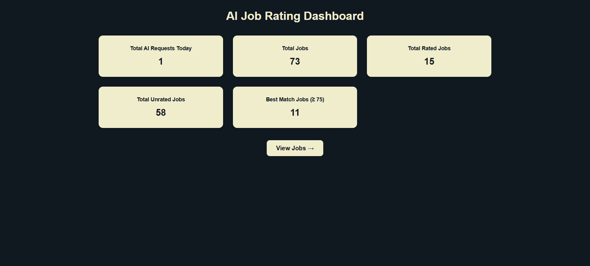
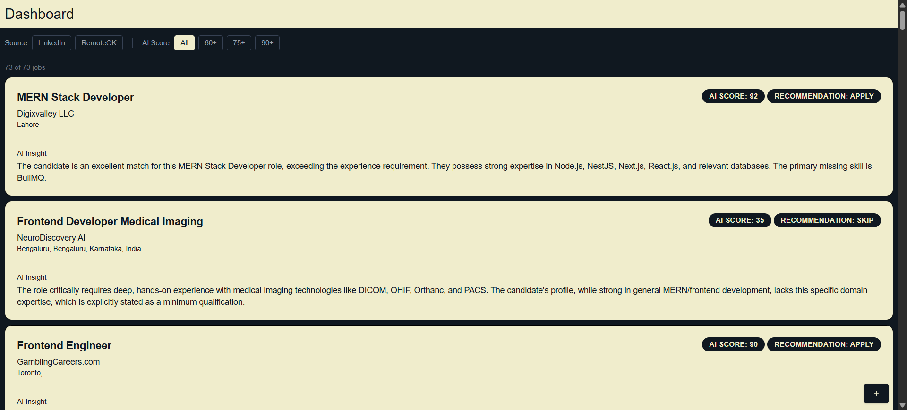
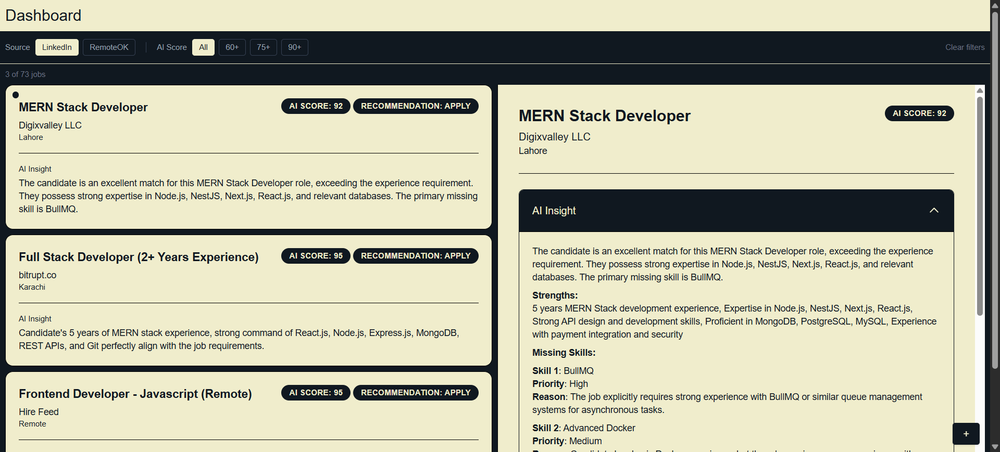
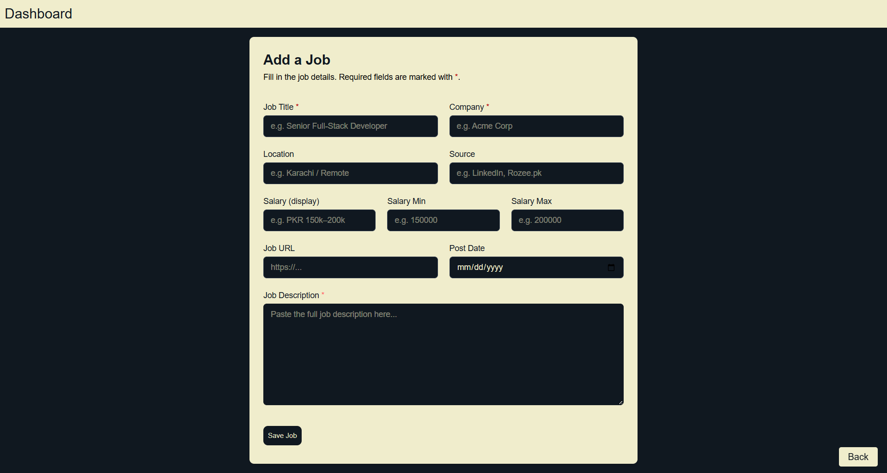

# AI Job Assistant

An AI-powered job assistant that helps software developers discover, prioritize, and prepare for job applications. It combines deterministic rule-based filtering with Gemini AI to analyze job opportunities, recommend whether to apply, identify missing skills, and generate personalized application materials.

Version 1 of this project is available in the `version-1` branch.

----------

## Why I Built This

Most job trackers just list postings. I wanted something that actually reasons about fit — scoring relevance before spending AI calls, then using AI only where it adds real value: matching, gap analysis, and drafting application materials. It's also a practical exercise in agent-oriented architecture and cost-aware AI system design.

----------

## Features

### Job Aggregation

-   Fetches jobs from external job APIs via a dedicated API route (`/api/jobs/fetch`), triggered manually — no UI button yet
-   Stores jobs in MongoDB
-   Prevents duplicate entries
-   Supports manually adding jobs via a form

### Rule-Based Analysis

Every fetched job is analyzed before AI is involved. The rule-based engine:

-   Calculates an **Interest Score** (0–100)
-   Determines whether the job is relevant
-   Prioritizes jobs in the dashboard
-   Filters out low-value jobs before AI analysis

This reduces unnecessary AI requests and keeps the system cost-efficient.

### AI Job Analysis

For relevant jobs, the assistant runs a full AI analysis using Gemini. The AI evaluates:

-   Overall job match (AI Score)
-   Recommendation (Apply / Consider / Skip)
-   Match reasoning
-   Candidate strengths
-   Missing skills to learn
-   Salary assessment
-   Professional cover letter
-   Professional application email

### AI Usage Management

Built around Gemini's free tier:

-   Daily request tracking
-   Request quota management
-   Cost-aware AI usage
-   AI analysis only when explicitly requested

----------


## Screenshots 
### Dashboard
  
### AI Job Analysis 
 
 
### Manually Add Job
 

-----

## Project Architecture

The project follows a modular architecture where responsibilities are separated into dedicated directories. Job-related logic lives under a `jobs` module, rule-based filtering and scoring are isolated in a `ruleBasedAnalysis` module, AI-specific functionality is grouped under an `ai` module, and agent orchestration sits in an `agent` module. This keeps business logic independent from API routes, making the codebase easier to maintain and extend.

The `/api/agent/analyze` endpoint acts as the entry point for job analysis. It validates the request, loads the selected job, checks whether it has already been analyzed, and then delegates the analysis workflow to the agent layer. The agent coordinates the process, while AI generation, prompt construction, response parsing, and database updates are handled by their respective modules. This keeps the API route lightweight and ensures each part of the application has a single, well-defined responsibility.

```
ai-job-agent
├─ app
│  ├─ api
│  │  ├─ agent
│  │  │  └─ analyze
│  │  │     └─ route.ts
│  │  └─ jobs
│  │     ├─ create
│  │     │  └─ route.ts
│  │     └─ fetch
│  │        └─ route.ts
│  ├─ components
│  │  ├─ accordion.tsx
│  │  ├─ badge.tsx
│  │  ├─ button.tsx
│  │  └─ toast.tsx
│  ├─ jobs
│  │  ├─ create
│  │  │  └─ page.tsx
│  │  ├─ page.tsx
│  │  └─ _components
│  │     ├─ header.tsx
│  │     ├─ jobCard.tsx
│  │     ├─ jobDetails.tsx
│  │     └─ jobList.tsx
│  ├─ layout.tsx
│  └─ page.tsx
├─ lib
│  ├─ agent
│  │  └─ analyzeJob.ts
│  ├─ ai
│  │  ├─ analyzeJobWithAI.ts
│  │  ├─ gemini.ts
│  │  ├─ profile.ts
│  │  ├─ prompts
│  │  │  └─ jobAnalysis.ts
│  │  ├─ schemas
│  │  │  └─ jobAnalysis.ts
│  │  └─ usage.ts
│  ├─ cron.ts
│  ├─ db.ts
│  ├─ models
│  │  ├─ AiUsage.ts
│  │  └─ Job.ts
│  ├─ ruleBasedAnalysis
│  │  ├─ relevance.ts
│  │  └─ score.ts
│  └─ types.ts
├─ public
│  └─ (screenshots, icons)
├─ docker-compose.yml
├─ Dockerfile
├─ package.json
└─ README.md

```

### Agent Layer

Entry point at `/api/agent/analyze`, with the workflow logic in `/lib/agent/analyzeJob.ts`. Responsibilities:

-   Validate requests
-   Load the selected job
-   Check for previous analysis
-   Delegate the workflow to the agent layer

### AI Layer

Responsible for:

-   Prompt construction
-   Candidate profile
-   Gemini integration
-   Structured JSON generation
-   Response parsing

### Rule-Based Analysis

Contains deterministic logic for:

-   Interest Score calculation
-   Job relevance detection

### Jobs Module

Responsible for:

-   Database operations
-   Job services
-   Business logic

----------

## Tech Stack

-   Next.js (App Router)
-   TypeScript
-   MongoDB
-   Mongoose
-   Gemini 2.5 Flash
-   REST APIs

----------

## AI Workflow

```
Job API
   │
   ▼
Fetch Jobs
   │
   ▼
Rule-Based Analysis
   │
   ├── Not Relevant → Display only
   │
   ▼
MongoDB
   │
   ▼
Analyze Job
   │
   ▼
Gemini AI
   │
   ▼
Analysis
   ├── AI Score
   ├── Recommendation
   ├── Strengths
   ├── Missing Skills
   ├── Salary Assessment
   ├── Cover Letter
   └── Email

```

----------

## Current AI Output

For every analyzed job, the assistant generates:

-   AI Score
-   Recommendation
-   Reason
-   Strengths
-   Missing Skills
-   Salary Assessment
-   HTML Cover Letter
-   HTML Application Email

----------

## Installation & Setup

### Prerequisites

-   Node.js 20+
-   npm
-   MongoDB (local or MongoDB Atlas)
-   A Gemini API key

### 1. Clone the repository

```bash
git clone https://github.com/Amir-zeb/ai-job-assistant.git
cd ai-job-assistant

```

### 2. Install dependencies

```bash
npm install

```

### 3. Create `.env.local`

```
MONGODB_URI=your_mongodb_connection_string
GEMINI_API_KEY=your_gemini_api_key
DOMAIN=http://localhost:3000

```

### 4. Run the project

```bash
npm run dev

```

The application will be available at `http://localhost:3000`.

### Running with Docker

A Dockerfile and Docker Compose configuration are included for containerized development and testing.

```bash
docker compose up --build

```

Or in detached mode:

```bash
docker compose up -d --build

```

The application will be available at `http://localhost:3000`.

**Notes:**

-   Ensure your MongoDB instance is accessible from the application.
-   A valid Gemini API key is required for AI-powered job analysis.
-   The project is designed to work within Gemini's free-tier limits through built-in usage tracking and optimized AI requests.

----------

## Learning Objectives

This project focuses on learning and applying:

-   AI-assisted application workflows
-   Agent-oriented architecture
-   Prompt engineering
-   Structured JSON generation
-   Modular backend design
-   Cost-aware AI systems
-   Background job processing
-   REST API integration

----------

## Repository

-   **main** — Current AI Job Assistant
-   **version-1** — Original AI Job Filtering & Rating Agent

----------

## License

MIT

----------

##### Develop by **Amir Zeb**.
